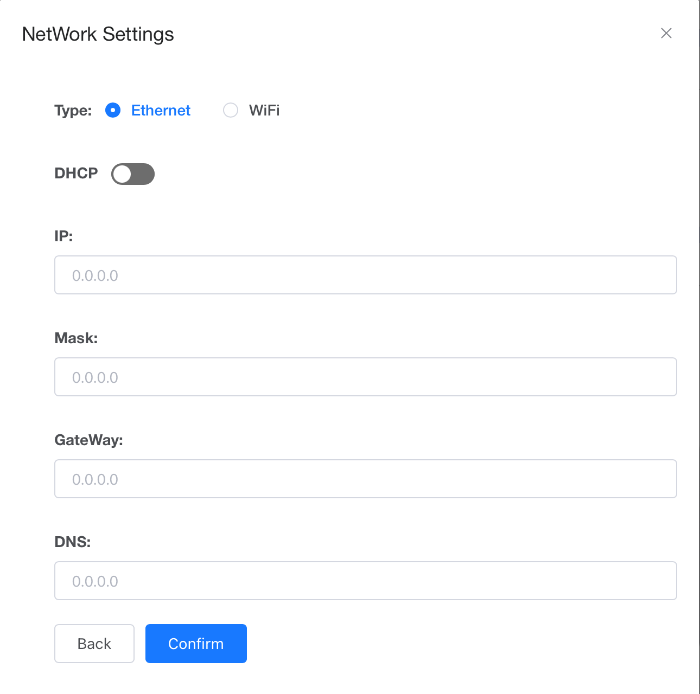

# MOKOCloud User Guide

Before login MOKOCloud, please use the APP to config the Gateway connect the network. For Remote Gateway or Others, you can use any MQTT broker. For LoRa Gateways, please use Chirpstack and configure the LoRa Device to the appropriate frequency band through the APP.

-------------------

### Supported product models：

***Remote Gateway***

`MKGW-mini 01``MK107``MK107D Pro``MK107D Pro-35D``MK110 Plus 01`

***Remote Gateway with metering***

`MK110 Plus 02``MK110 Plus 03`

***POE Gateway***

`MKGW3`

***Cellular Gateway***

`MKGW4`

***USB Gateway***

`MKGW7`

***Other Gateway***

`MKGW1`

***LoRa Device***

`LW003-B``LW001-BG PRO(L)``LW001-BG PRO(M)``LW004-PB``LW004-CT``LW005-MP``LW007-PIR``LW008-MT`

> MKGW1、MKGW2 user Web to configure parameters,LoRa Device use APP `MKLoRa` ,Other gateway use APP `MKScannerPro`

-------------------

### Guide

- **[How to add a Gateway](## How to add a Gateway)**
- **[Gateway information](## Gateway information)**
- **[How to view scanned Bluetooth Devices](## How to view scanned Bluetooth Devices)**
- **[How to connect the scanned Bluetooth Device](## How to connect the scanned Bluetooth Device)**
- **[View historical data of Bluetooth Devices](## View historical data of Bluetooth Devices)**
- **[Simulation demo](## Simulation demo)**

## How to add a Gateway

### Configuring Gateway connect to network,eg:

***MKGW3(PoE)***
	

	
***MKGW2(LoRa)***
	

	
Confirm your account is online.If your account shows as “Disconnected” after logging in, please contact the administrator.

	
### Add Gateway

***Use APP to add batches***

***Manually add***

> Gateway Management -> Create Gateway

	
## Gateway information

### Gateway list

> After adding the gateway successfully, it will be in offline status by default. Click on "Subscribe", and once the platform receives the data reported by the gateway, it will be updated to online status.

> You can view information such as the name, MAC address, product model, online status, and latest update time of the added gateway. It supports config scanner filters, payload parameters, gateway settings, as well as restarting and resetting the gateway.

### Configure Scanner filter, and Payload Parameters

> MOKOCloud can help you setting the gateway's scanning filter conditions. It supports filtering by RSSI, MAC address, Name, Raw Data, and Duplicate Data. 

> You can also configure the payload parameters of the uplink scanning data. This can be done under: “Gateway Management -> Scanner & Upload Option”.

### Configure Gateway Parameters

> In the detail page, you can modify the gateway's network access method, MQTT parameters, function parameters, gateway OTA, and other functions. This can be done under: “Gateway Management -> Detail”.

#### Set Up WiFi

> Some gateways only support WiFi for network access. After modifying WiFi parameters, the gateway needs to be restarted for the changes to take effect.

#### Set Up MQTT

> Changing the MQTT server or parameters that the gateway connects to requires a restart of the gateway for the changes to take effect.

#### Network Setting

> Some gateways that support both Ethernet and WiFi can choose to switch between network access methods. Changes will take effect after the gateway is restarted. 

#### Function Configuration

> This includes configuring parameters such as scan switch, indicator light switch, and heartbeat packet interval. Changes take effect immediately after configuration.

#### OTA

> The gateway will automatically download and upgrade the firmware package. After a successful upgrade, the gateway will restart and rejoin the network.

