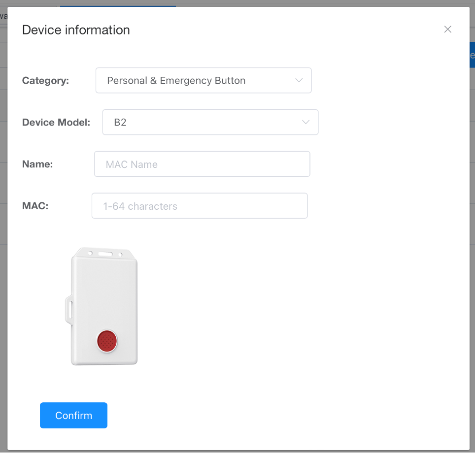

# MOKO IoT DM User Guide

Before login MOKO IoT DM, please use the APP to config the Gateway connect the network. For Remote Gateway or Others, you can use any MQTT broker. For LoRa Gateways, please use Chirpstack and configure the LoRa Device to the appropriate frequency band through the APP.

-------------------

### Supported product models：

**Bluetooth Gateway:**

***[Remote Gateway](#0)***

`MKGW-mini 01` `MK107` `MK107D Pro-35D` `MK110 Plus 01`

***[Remote Gateway with metering](#0)***

`MK110 Plus 02` `MK110 Plus 03`

***[Indoor POE Gateway](#0)***

`MKGW3`

***[Bluetooth to Cellular](#0)***

`MKGW4`

***[USB Gateway](#0)***

`MKGW7`

***[Bluetooth to LoRaWAN](#0)***

`LW003-B`

***[Other Gateway](#0)***

`MKGW1` `MKGW2`

**LoRa Device:**

***[LoRa Node](#8)***

 `LW001-BG PRO(L)` `LW001-BG PRO(M)` `LW004-PB` `LW004-CT` `LW005-MP` `LW006-SB` `LW007-PIR` `LW008-MT`

> MKGW1、MKGW2 user Web to configure parameters,LoRa Device use APP `MKLoRa` ,Other gateway use APP `MKScannerPro`

-------------------

### <a id="0">Guide</a>

- **[How to add a Gateway](#1)**
- **[Gateway information](#2)**
- **[How to view scanned Bluetooth Devices](#3)**
- **[How to connect the scanned Bluetooth Device](#4)**
- **[Simulation demo](#5)**
- **[Batch Operations](#6)**
- **[Cellular Gateway](#7)**
- **[LoRa Node](#8)**
- **[Version](#100)**

## <a id="1">How to add a Gateway</a>

### Configuring Gateway connect to network,eg:

***MKGW3(PoE)***
	

***MKGW4(Cellular)***
	

	
***MKGW2(LoRa)***
	

	
Confirm your account is online.If your account shows as “Disconnected” after logging in, please contact the administrator.

	
### Add Gateway

***Use APP to add batches***

***Manually add***

> Gateway Management -> Create Gateway

	
## <a id="2">Gateway information</a>

### Gateway list

> After adding the gateway successfully, it will be in offline status by default. Click on "Subscribe", and once the platform receives the data reported by the gateway, it will be updated to online status.

> You can view information such as the name, MAC address, product model, online status, and latest update time of the added gateway. It supports config scanner filters, payload parameters, gateway settings, as well as restarting and resetting the gateway.

### Configure Scanner filter, and Payload Parameters

> IoT DM can help you setting the gateway's scanning filter conditions. It supports filtering by RSSI, MAC address, Name, Raw Data, and Duplicate Data. 

> You can also configure the payload parameters of the uplink scanning data. This can be done under: “Gateway Management -> Scanner & Upload Option”.

### Configure Gateway Parameters

> In the detail page, you can modify the gateway's network access method, MQTT parameters, function parameters, gateway OTA, and other functions. This can be done under: “Gateway Management -> Detail”.

#### WiFi Settings

> Some gateways only support WiFi for network access. After modifying WiFi parameters, the gateway needs to be restarted for the changes to take effect.

#### MQTT Settings

> Changing the MQTT server or parameters that the gateway connects to requires a restart of the gateway for the changes to take effect.

#### Network Settings

> Some gateways that support both Ethernet and WiFi can choose to switch between network access methods. Changes will take effect after the gateway is restarted. 

#### OTA

> The gateway will automatically download and upgrade the firmware package. After a successful upgrade, the gateway will restart and rejoin the network.

#### Function Configuration

> This includes configuring parameters such as scan switch, indicator light switch, and heartbeat packet interval. Changes take effect immediately after configuration.Different gateway configuration items are slightly different

## <a id="3">How to view scanned Bluetooth Devices</a>

### Add Device

***Use Excel to add batches***

***Manually add***

### Device List

> After successfully adding a device, the list will display all current devices. If the device is scanned by a previously added gateway, refreshing the page will update the device's RSSI value and the last time it was scanned.

> You can also view device details, access historical data, and perform deletion operations.

## <a id="4">How to connect the scanned Bluetooth Device</a>

> If the current gateway supports connecting to the device, a "Connect" button will be displayed. The default connection password is Moko4321. After connecting, different operation pages will be displayed based on the device model.
Below are the details page and operation page after connecting to H4 Pro. It supports remote shutdown and reading local storage data.

> Here are the details page and operation page after connecting to B2. It supports remote alarm deactivation, control of LED flashing and buzzer, as well as remote OTA.

> Note: A gateway can only connect to one device at a time. If you wish to connect to another device, please disconnect the current connection first.

## <a id="5">Simulation demo</a>

### Indoor Location Simulation

> Deploy up to four gateways at least 5 meters apart to simulate different areas. Equip personnel or assets with button alarm devices to move between these areas. You will be able to observe corresponding changes in the simulated areas on the graphical representation as the devices move.

> By pressing the button on the device, the corresponding area will turn red. Simultaneously, a "Dismiss Alarm Status" button will appear. Clicking this button will automatically connect to the device to deactivate the alarm. Once deactivated, the device will disconnect, canceling the alarm, and the area will return to its original green state.  

### Sensor Device Demo

> If you have sensor devices added to the platform, you can use this feature to simultaneously view the sensor statuses of all devices. After selecting a device, they will be arranged in a grid below. For H4 Pro and ToF devices, you need to set thresholds in the "Setting" section. When these thresholds are exceeded, the device's status color will change, allowing you to simulate various alarm scenarios. 

## <a id="6">Batch Operations</a>

### Batch Device Upgrade

> If there is a batch of devices that require a firmware update, you can utilize the platform's batch upgrade feature. Firstly, you need to select gateways capable of connecting to the target devices. The platform supports a maximum of 10 gateways for this purpose. 

> Please provide the firmware address required for the upgrade. The devices undergoing the upgrade must be of the same model.

> Import the Excel file containing the devices that require an upgrade.

> Click on "Batch Start" to initiate the upgrade process. During the upgrade, the progress bar for each device will be displayed. In case of an upgrade failure, you can click "Retry" to attempt the upgrade again. Please note that one gateway can only upgrade one device at a time. After completing the upgrade for one device, the process will continue with the next device.

## <a id="7">Cellular Gateway</a>

> The cellular gateway supports scanning, reporting of positioning information, alarm, and sending of configuration parameters. Since the gateway is not continuously online, the sent parameters will be stored in the queue and will be sent after the device is online.

> The read and configured commands are stored in the downlink message queue, and the execution status of the message can be viewed.this can be done under: “Cellular Gateway -> Down Link Message”.

## <a id="8">LoRa Node</a>

### Config device connect LoRaWAN

> First, you need to register the LoRa device to Chirpstack and use the APP to configure the device to access the network.Currently supported regions:AS923、AU915_0、AU915_1、EU868、US915_0、US915_1

***Chirpstack***

***MKLoRa***

### Add LoRa Device

> After successfully registering on Chirpstack, you can get the Application Id and the device's DevEUI, generate a Topic for the device, and then create the device on the IoT DM.

### Device info & Downlink message

> On the device details page, you can send commands to the device. The message will be stored in the queue. When the device reports, you will receive the device's response data.

### History

> The data reported by the device will be divided by port. You can view the original data and the decoded data

> When the device has a positioning function, after filtering the successfully located ports, you can view the path display of the device on the map.

## <a id="100">Version</a>

| Version | Revision History | Editor | Date |
| --- | --- | --- | --- |
| V1.0.0 | Create, Official Version | wenzheng Liu | 2023/05/17 |
| V1.0.1 | Modify, Add Multi-Gateway Compatibility | wenzheng Liu | 2023/09/25 |
| V1.0.2 | Modify, Add Batch Upgrade | wenzheng Liu | 2023/11/01 |
| V1.0.3 | Modify, Add Cellular Gateway,LoRa Device | wenzheng Liu | 2024/10/10 |
